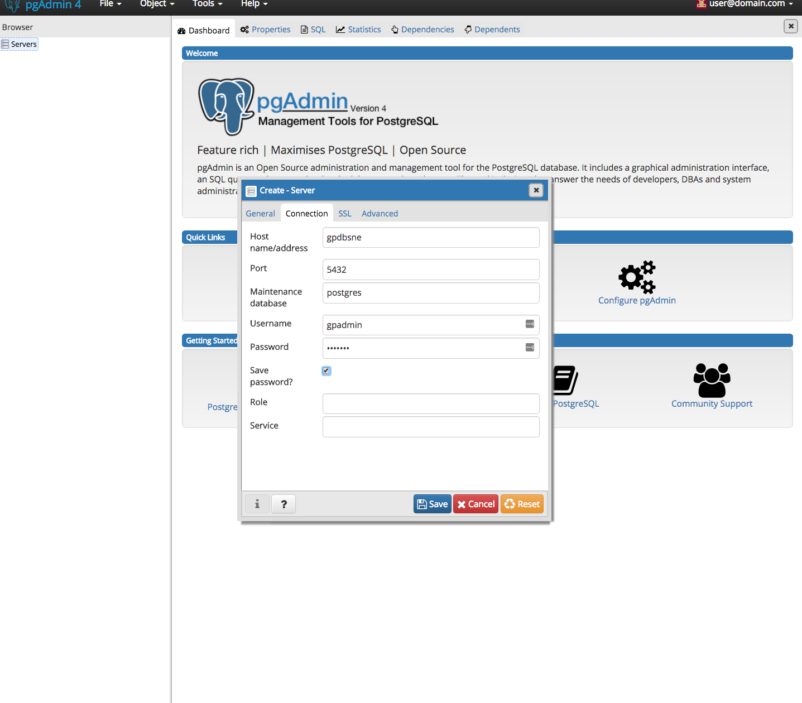
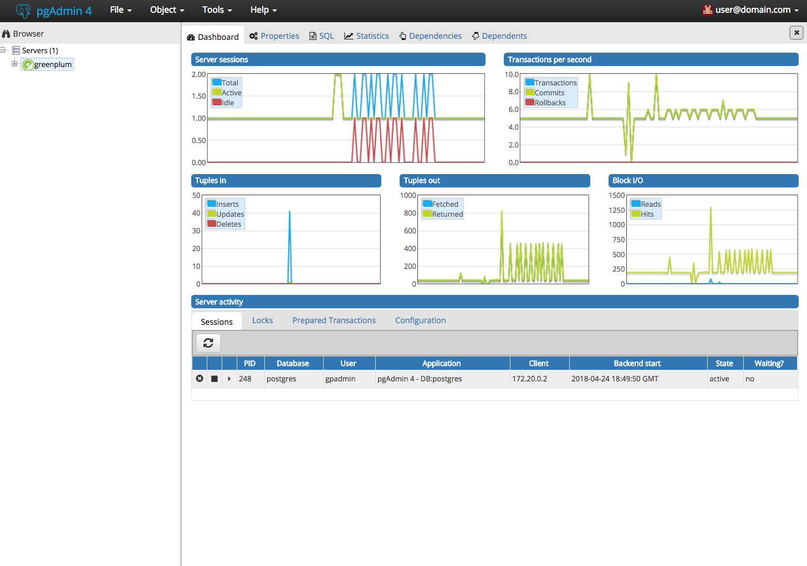

# Pivotal Greenplum
The Pivotal Greenplum Database (GPDB) is an advanced, fully featured, open source data warehouse. It provides powerful and rapid analytics on petabyte scale data volumes. Uniquely geared toward big data analytics, Greenplum Database is powered by the world’s most advanced cost-based query optimizer delivering high analytical query performance on large data volumes.
<https://pivotal.io/pivotal-greenplum>

# pgAdmin
pgAdmin is the most popular and feature rich Open Source administration and development platform for PostgreSQL, the most advanced Open Source database in the world.
<https://www.pgadmin.org/>

## Use pgAdmin to access Greenplum database:
You can use manage databases and tables that are stored in Greenplum.

Use cases for database administrator:
1. View Server sessions to ensure the performance and utilization of the system
2. View Transactions Per Second to identify performance bottlenecks and potential database issues.
3. Identify server activities

## Reference:
[pgadmin4 open source repo](https://github.com/greenplum-db/pgadmin4)
